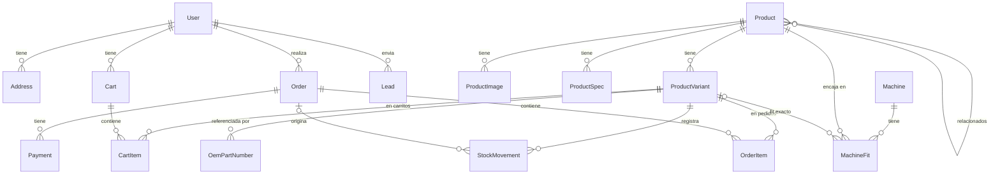

# Modelo de datos — MRB (Fase 2)

Documentación del schema definido en `prisma/schema.prisma`. El modelo es el **contrato objetivo de la Fase 2**: en la Fase 1 no hay base de datos conectada (no existe `DATABASE_URL`) y el catálogo corre desde `src/data/products.ts`. Las migraciones (`npx prisma migrate dev`) se ejecutan solo cuando exista una base de datos.

**Alcance confirmado (2026-07-12):** e-commerce completo (carrito, checkout, pedidos, pagos), catálogo en BD con variantes por dimensión y control de stock, cuentas de administrador y de cliente, cross-reference de máquinas/OEM que alimenta el buscador BeltMatch, y el formulario público de cotización (Lead).

## Vista general

## Bloques

### 1. Usuarios y direcciones

| Modelo | Propósito |
|---|---|
| `User` | Cuenta única para admin y clientes, diferenciada por `role` (`ADMIN` / `CUSTOMER`). Incluye `passwordHash` (auth por credenciales), `company` y `phone` por el perfil B2B del negocio. |
| `Address` | Direcciones guardadas del cliente (`label` tipo "Belfast quarry site", `isDefault`). Se borran en cascada con el usuario. |

### 2. Catálogo, variantes y stock

| Modelo | Propósito |
|---|---|
| `Product` | La familia comercial (p. ej. "Endless Belt"): slug, SKU de familia (`MB-EB`), contenido de marketing (descripción, features, aplicaciones, estándares), disponibilidad, `featured`, `active` (despublicar sin borrar) y relación reflexiva `related` (productos relacionados). |
| `ProductImage` / `ProductSpec` | Imágenes (hero + galería vía `isHero`/`sort`) y filas de especificación (`label`/`value`, el value se renderiza en IBM Plex Mono). |
| `ProductVariant` | **La unidad vendible.** Configuración concreta: SKU propio (`MB-4471-EP`), formato (`ENDLESS`, `OPEN_LENGTH`, `CLIPPED`, `ZIP_CLIP` — espeja los beltFormats del home), dimensiones (`widthMm`, `lengthMm`, `plies`), `coverGrade`, precio y stock. Carritos y pedidos siempre referencian variantes, nunca productos. |
| `StockMovement` | Historial auditable de inventario (`delta` ± con `reason`: ORDER, RESTOCK, ADJUSTMENT, RETURN, y `orderId` opcional). `ProductVariant.stockQty` es el total cacheado; los movimientos son la fuente de verdad para auditoría. |

Decisiones clave:

- **`priceCents` es opcional**: `null` = precio bajo cotización. Permite que venta directa (in-stock) y flujo de cotización (made-to-order) convivan en el mismo catálogo.
- **Dinero en centavos enteros** (`Int`), nunca flotantes. Moneda por registro con default `GBP`.
- `lowStockAt` es el umbral de alerta para el panel admin; `leadTimeDays` aplica a variantes made-to-order.

### 3. Cross-reference de máquinas / OEM (buscador BeltMatch)

| Modelo | Propósito |
|---|---|
| `Machine` | Marca + modelo (`Powerscreen` / `Chieftain 1400`) con `aliases` para variantes de escritura buscables. Único por `(brand, model)`. |
| `MachineFit` | Qué correa encaja en qué máquina y en qué posición del transportador ("Main conveyor", "Side conveyor"), con `variantId` opcional cuando se conoce el fit exacto y el `oemPartNumber` de esa posición. Único por `(machineId, productId, position)`. |
| `OemPartNumber` | Código OEM normalizado (mayúsculas, sin separadores) → variante exacta. Es la ruta del buscador "By OEM part #". |

En la Fase 1 estos tres modelos tienen su espejo en TypeScript en `src/data/machines.ts`, y `src/lib/search.ts` busca sobre ellos en memoria. La Fase 2 sustituye el interior de `searchProducts()` por consultas a estas tablas sin cambiar la firma.

### 4. Carrito y checkout

| Modelo | Propósito |
|---|---|
| `Cart` / `CartItem` | Carrito de usuario o de invitado (`sessionId` único por cookie; `userId` nullable para fusionar el carrito al iniciar sesión). Un ítem por variante (`@@unique([cartId, variantId])`), cantidad simple; el precio se resuelve al momento del checkout. |
| `Order` | Pedido con `number` legible (`MRB-2026-00042`), estado (`PENDING → PAID → PROCESSING → SHIPPED → DELIVERED`, más `CANCELLED`/`REFUNDED`), totales desnormalizados (`subtotal/shipping/tax/totalCents`) y **snapshot completo de la dirección de envío** (campos `ship*`). Soporta checkout de invitado (`userId` nullable; `email`/`phone` siempre presentes). |
| `OrderItem` | Línea de pedido con **snapshot** de `productName`, `variantSku` y `unitPriceCents`; `variantId` es nullable con `onDelete: SetNull`. |
| `Payment` | Intento de pago por proveedor (`provider` = "stripe" u otro, `providerRef`, `status`, monto). Un pedido puede tener varios intentos. |

Decisiones clave:

- **Los pedidos son snapshots**: dirección y líneas se congelan al crear el pedido para que el historial sobreviva a ediciones o borrados de direcciones, variantes y productos.
- Al pagar un pedido se registra el descuento de stock como `StockMovement(reason: ORDER, orderId)` — así el inventario y las ventas quedan conciliables.
- Usuarios borrados no borran sus pedidos (`onDelete: SetNull`): el registro comercial se conserva.

### 5. Leads (formulario público de cotización)

`Lead` conserva el modelo de la Fase 1 — **debe seguir espejado con el validador Zod** `src/lib/validators/quote.ts` (regla de CLAUDE.md). Cambios respecto a la Fase 1: `userId` opcional para enlazar la cotización cuando la envía un cliente autenticado. Estados: `NEW → CONTACTED → QUOTED → CLOSED`; urgencia `DOWN_NOW` / `PLANNED` (los dos buying moments del sitio).

## Convenciones transversales

- IDs `cuid()` en todos los modelos; `createdAt`/`updatedAt` en las entidades con ciclo de vida.
- Enums para todo vocabulario cerrado (roles, estados, formatos, razones de stock).
- Borrado: cascada solo para hijos sin valor propio (imágenes, specs, ítems); `SetNull` donde el histórico debe sobrevivir (pedidos, leads, order items).
- Índices en las llaves foráneas consultadas y en los listados de trabajo (`Order`/`Lead` por `[status, createdAt]`, `StockMovement` por `[variantId, createdAt]`).

## Migración desde la Fase 1

> Estado: la migración inicial ya existe (`prisma/migrations/20260712000000_init/`) y fue verificada contra un Postgres local. La conexión se configura en `prisma.config.ts` (convención Prisma 7: la `url` ya no va en `schema.prisma`), que lee `DATABASE_URL` de `.env`. El `docker-compose.yml` de la raíz levanta el Postgres local (`docker compose up -d`).

1. Con la BD corriendo, aplicar la migración: `npx prisma migrate deploy` (o `migrate dev` durante el desarrollo).
2. Sembrar el catálogo desde `src/data/products.ts` (productos, imágenes, specs) y el cross-reference desde `src/data/machines.ts` (máquinas, fits, códigos OEM) — las formas coinciden campo a campo.
3. Crear variantes reales con precio/stock (hoy los datos TS no tienen variantes; los SKUs de `mbPartNumbers` son el punto de partida).
4. Cambiar `searchProducts()` a consultas Prisma y conectar el quote form a un route handler que persista `Lead` (sin server actions, según las reglas del proyecto).
